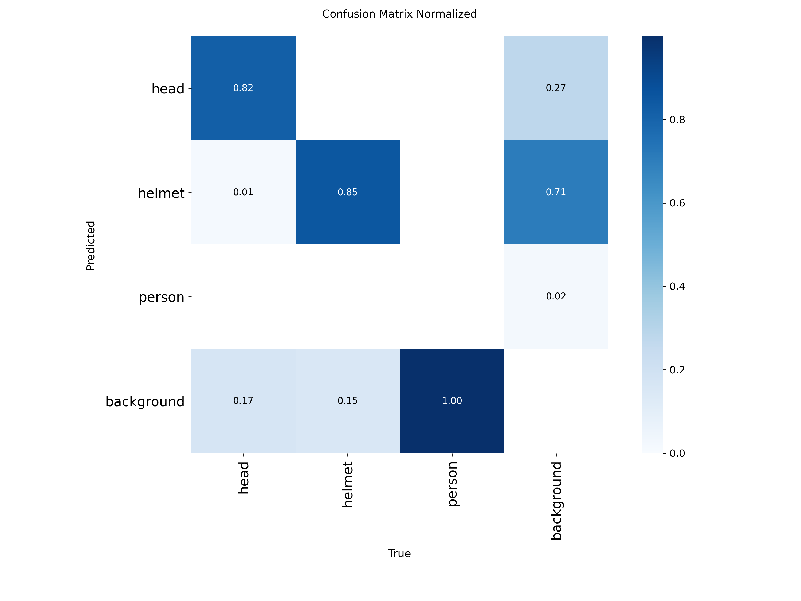
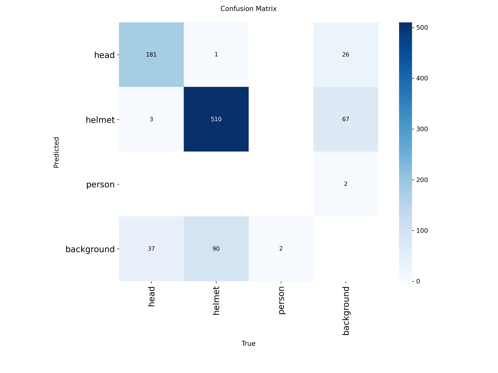
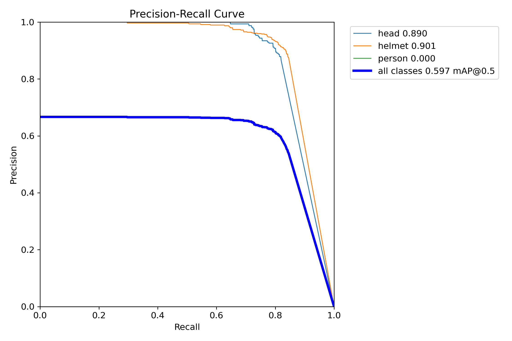
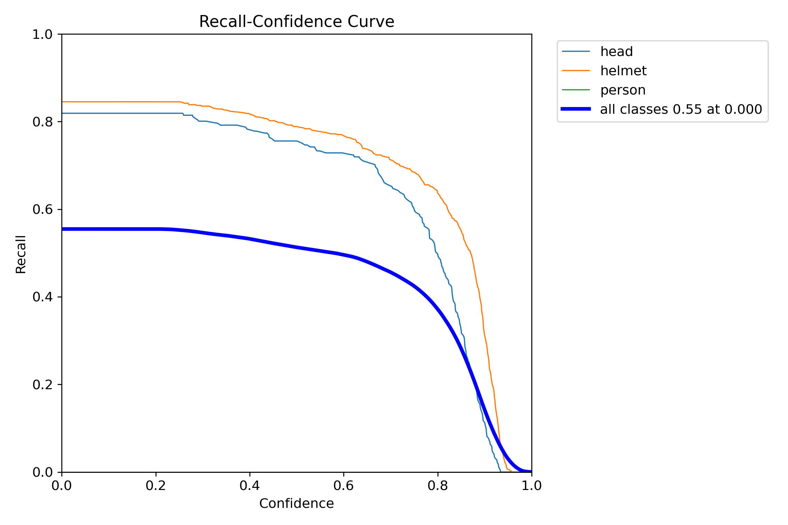
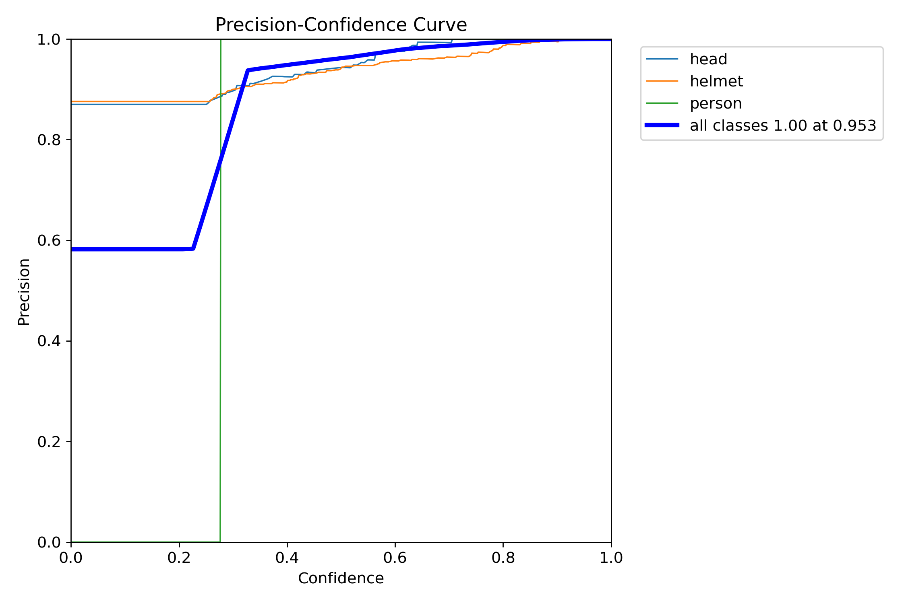
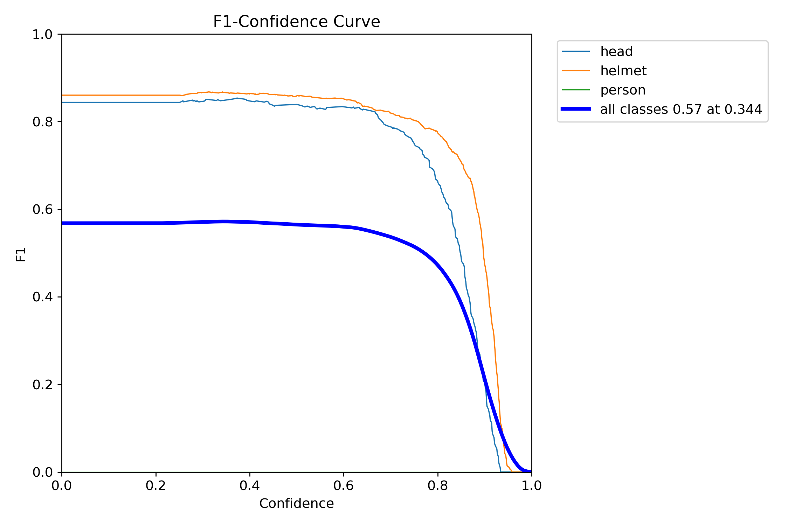
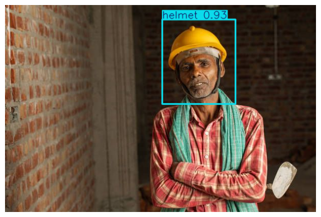

# Helmet and Head Detection Using YOLO
## Overview
This project implements a helmet and head detection system using YOLO for safety monitoring in construction and industrial environments. The model identifies individuals as either wearing a helmet or not wearing a helmet, enabling automated PPE compliance using images or live video streams.

## Objectives
- Detect helmet vs bare head (no helmet)

## Dataset
- Two object classes:
  - Helmet
  - Head (No Helmet)
- Annotations in YOLO format
- Split into train, validation, and test sets
- Images from varied backgrounds, angles, and lighting conditions

## Model Training
- Models tested: YOLOv8, YOLOv10, YOLOv11
- Final model trained using YOLOv10
- Training features:
  - Early stopping
  - Data augmentation
  - Optimized epochs and resolution
  - Evaluation on validation and test sets

---

# RESULTS

## Normalized Confusion Matrix

## Raw Confusion Matrix

## Precision-Recall Curve

## Recall Curve

## Precision Curve

## F1 Score Curve

## Sample Predictions

.png)

---

# Evaluation Summary
- Strong detection for both helmet and head classes
- Very low confusion between helmet and head
- High recall and precision across multiple confidence thresholds
- Accurate performance on varied environments and camera angles
- Suitable for CCTV analytics, workplace safety automation, and industrial monitoring

# Applications
- Construction site monitoring
- PPE safety compliance systems
- Industrial workplace surveillance
- Automated alerting and analytics for bare-head detection
